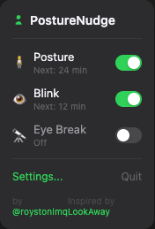
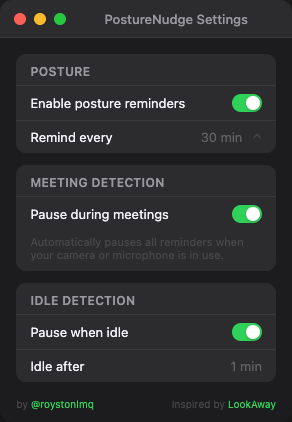
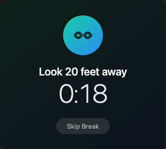

# PostureNudge

A simple macOS menu bar app that reminds you to check your posture, blink, and take eye breaks.

## Features

- **Posture reminder** - animated stick figure showing slouched-to-upright transition
- **Blink reminder** - blinking eye icon appears on screen
- **20-20-20 eye break** - full-screen overlay with countdown timer. Look 20 feet away for 20 seconds. Skip button to dismiss early
- **Meeting detection** - auto-pauses all reminders when your camera or microphone is in use (Zoom, Meet, Teams, etc.). No permissions needed
- **Idle detection** - pauses reminders when you step away from your computer
- **Screen lock detection** - automatically pauses reminders when your display sleeps or you lock your screen
- **Launch at login** - optional toggle in Settings to start PostureNudge automatically when you log in
- **Multi-monitor** - overlays appear centered on all connected displays
- **Configurable** - set interval for each reminder independently (1-120 min)
- **Menu bar only** - no dock icon, lives quietly in your menu bar

## Screenshots

<p align="center">
  
  &nbsp;&nbsp;
  
  &nbsp;&nbsp;
  
</p>

## Requirements

- macOS 14.0+
- [Xcodegen](https://github.com/yonaskolb/XcodeGen) (for building from source)

## Install

Download the latest DMG from [Releases](https://github.com/roystonlmq/posture-nudge/releases), open it, and drag PostureNudge to Applications.

> **Note:** The app is ad-hoc signed. On first launch, right-click > Open to bypass Gatekeeper.

## Build from source

```bash
git clone https://github.com/roystonlmq/posture-nudge.git
cd posture-nudge
xcodegen generate
open PostureNudge.xcodeproj
# Cmd+R to build and run
```

## How it works

- **Posture & Blink**: Small icon overlay appears centered on screen for 4 seconds with a sound cue. Click to dismiss early.
- **Eye Break**: Full-screen dimmed overlay blocks your screen with a 20-second countdown. Press "Skip Break" to dismiss early.
- **Meeting Detection**: Uses CoreMediaIO and CoreAudio APIs to check if any camera or microphone is actively streaming. No camera/mic permission needed - these are read-only system queries.
- **Idle Detection**: Uses `CGEventSource.secondsSinceLastEventType` to check time since last keyboard/mouse input.
- **Screen Lock Detection**: Observes `NSWorkspace.screensDidSleepNotification` / `screensDidWakeNotification` to pause and resume when the display sleeps or wakes.
- **Launch at Login**: Uses `SMAppService.mainApp` from the ServiceManagement framework. No helper app needed.

Both meeting and idle detection use hysteresis to avoid flapping (5s to enter pause, 10s to exit).

## Tech

- SwiftUI + AppKit (menu bar, overlays)
- CoreMediaIO (camera detection)
- CoreAudio (microphone detection)
- CoreGraphics (idle detection)
- ServiceManagement (launch at login)
- No third-party dependencies

## Privacy

PostureNudge runs entirely offline with no network calls, analytics, or telemetry. All settings are stored locally in UserDefaults.

Meeting detection uses read-only system APIs (CoreMediaIO, CoreAudio) to check if any camera or microphone is actively streaming. The app cannot access audio/video content, only whether a device is in use.

## License

MIT
